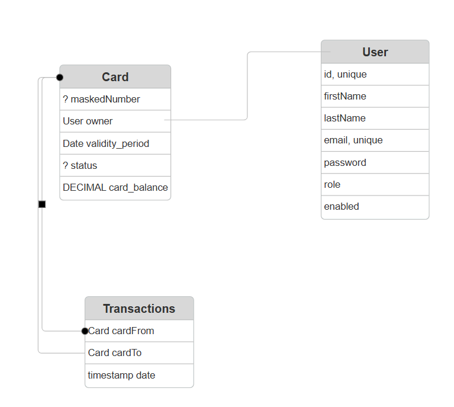

# CardVault
Test task for Java internship in EffectiveMobile
Use Java 21, Spring Boot 3.4.5, Gradle

## How to run
1. Install git and Docker
2. Clone repo, change directory
    ```
   cd CardVault
   ```
3. Add environment:
```
    echo SPRING_DATASOURCE_URL=jdbc:postgresql://cardvault_db-host:5432/cardvault_db>> src/main/resources/cardvault-app.env
    echo SPRING_DATASOURCE_USERNAME=cardvault>> src/main/resources/cardvault-app.env 
    echo SPRING_DATASOURCE_PASSWORD=cardvault>> src/main/resources/cardvault-app.env
    echo APP_JWT_SECRET_KEY=secretsecretsecretsecretsecretsecret>>src/main/resources/cardvault-app.env
    echo APP_JWT_EXPIRATION_MS=900000>>src/main/resources/cardvault-app.env
```
   
   ```
     echo POSTGRES_USER=cardvault>>postgres/cardvault_db.env
     echo POSTGRES_PASSWORD=cardvault>>postgres/cardvault_db.env
     echo POSTGRES_DB=cardvault_db>>postgres/cardvault_db.env
     echo PGDATA=/var/lib/postgresql/data>>postgres/cardvault_db.env
   ```

4. Run
```
    docker compose up
  ```

## About
